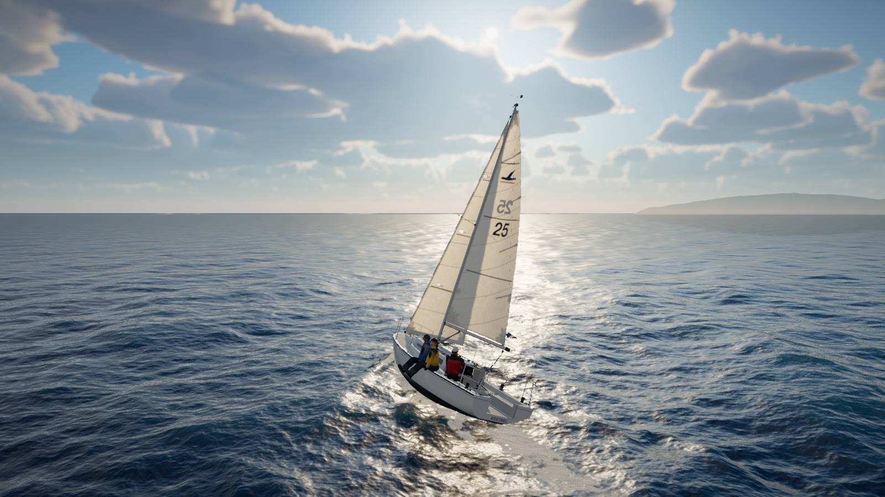
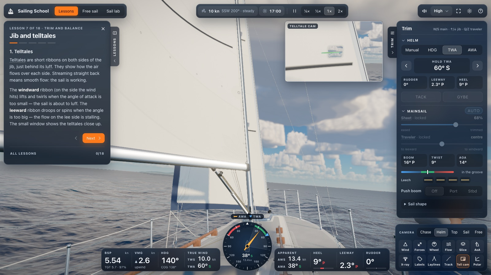
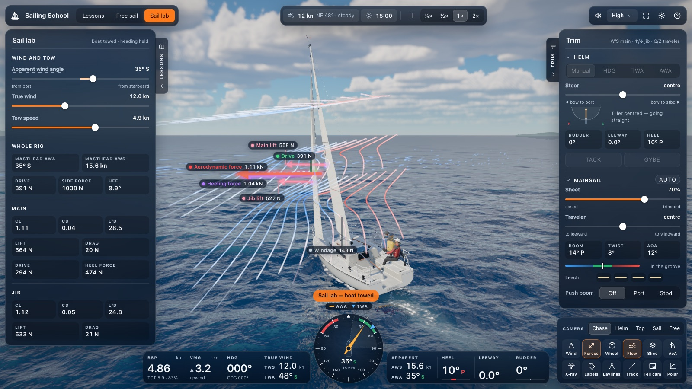
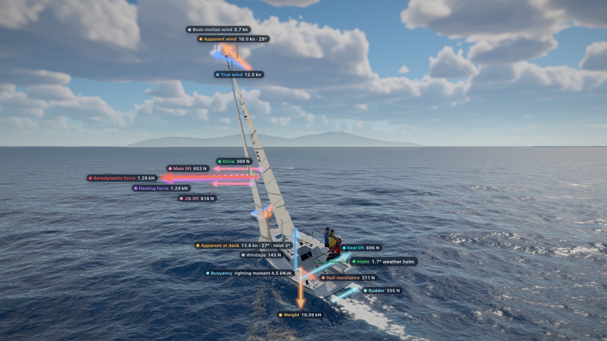
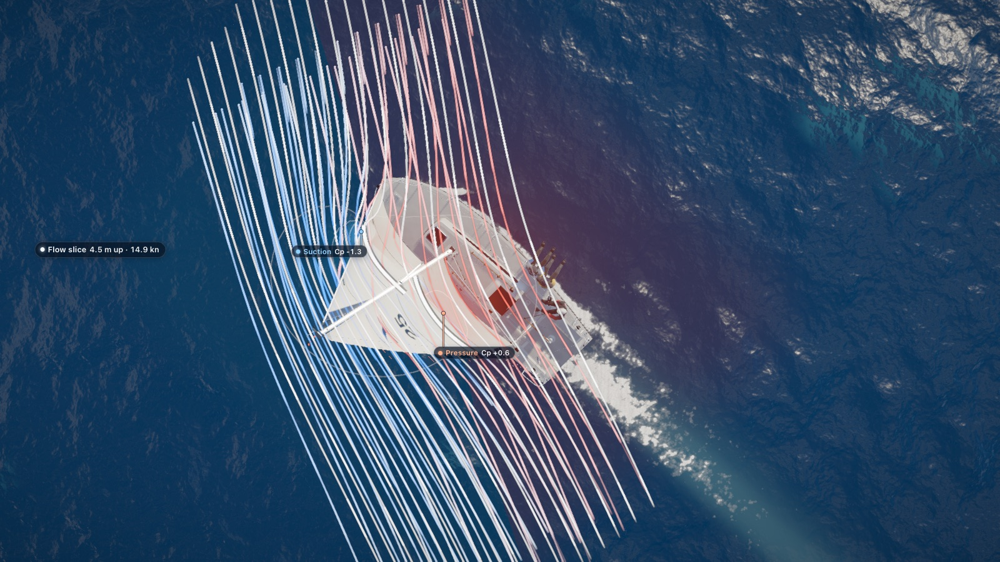
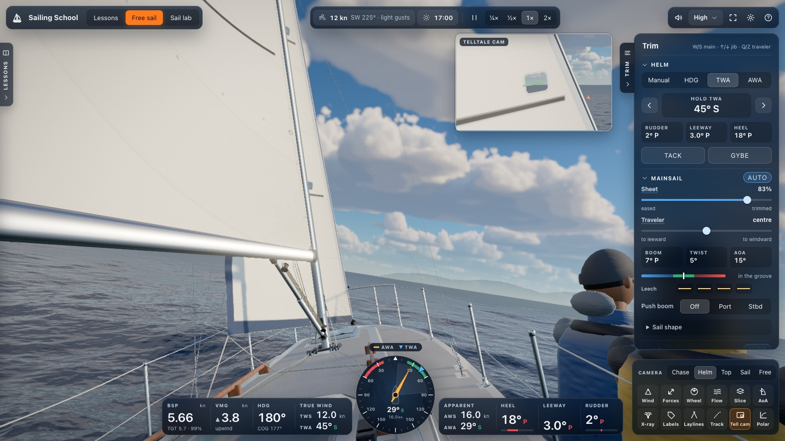
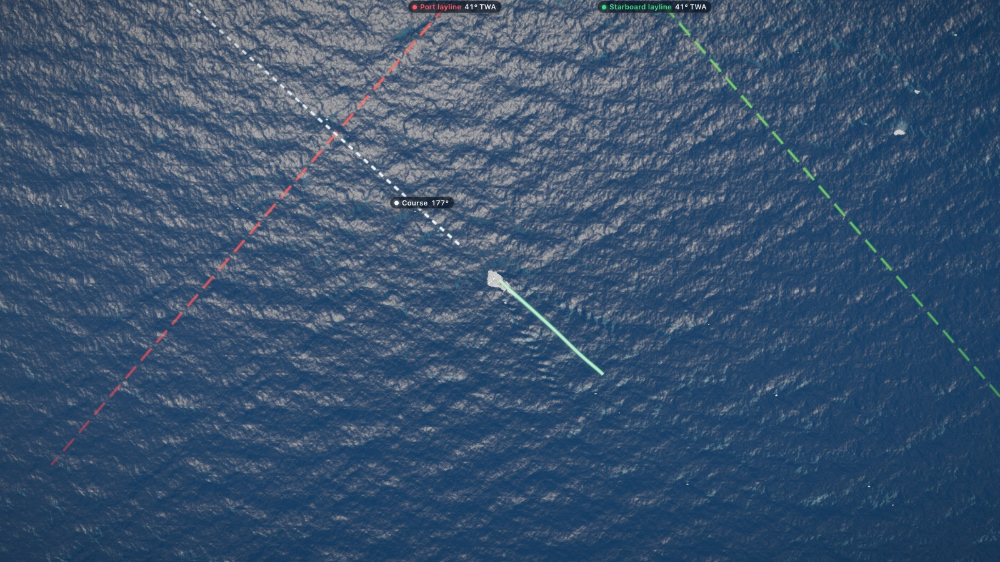
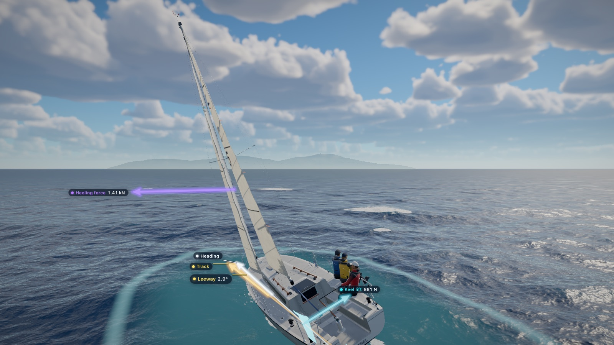
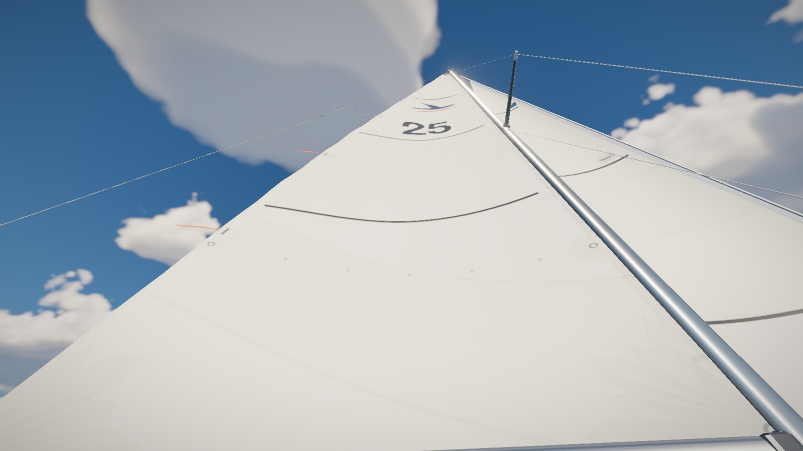

# Sailing School

Learn how the wind drives a sailboat, by sailing one in your browser: a 3-D keelboat on a real-time physics model.

[](https://github.com/pibvbp/sailing-school/actions/workflows/ci.yml)
[](https://github.com/pibvbp/sailing-school/actions/workflows/pages.yml)
[](LICENSE)

**Sail it now: <https://pibvbp.github.io/sailing-school/>**. It runs in the browser, with nothing to install and no
account.



You sail the **Kestrel 25**, a fictional but typical 25 ft (7.6 m) keelboat with a mainsail, a roller-furling jib and
a symmetric spinnaker. The simulation runs 120 times a second, and the app makes its workings visible:

- the **apparent wind**: the wind the boat actually feels, once its own motion is added;
- **lift and drag** on the main, jib and spinnaker;
- **angle of attack**, and the difference between luffing and stalling;
- the **keel and leeway**: why a boat can sail upwind at all;
- **heel and balance**, and why an over-pressed boat rounds up;
- **tacking and gybing**.

There is no canned animation. When the sails flap, the boat rounds up or the boom crashes across, it's because the
physics says so.

## What you can learn

There are 18 guided lessons in six modules. Each step sets up the wind, the boat, the camera and the overlays, and
decides which controls are live. The app then checks what you do in the live simulation.

- If you are stuck, **Hint** gives advice for the situation you are in.
- **Show me** lets the crew demonstrate. It hands the controls back as soon as you touch them.
- Each lesson ends with a short quiz.
- Your ticks are saved in your browser.
- A lesson borrows the view: when you leave it, the overlays and the camera go back to the way you had them.



**First steps**

1. **Meet the boat.** The parts of a keelboat, port and starboard, and why the tiller steers backwards.
2. **Finding the wind.** Read the wind from the water, the sky and the boat, meet the no-go zone, and point head to
   wind.
3. **Points of sail.** Close-hauled, reaching and running: the names for your angle to the wind, and how fast each one
   is.

**How sails work**

4. **Apparent wind.** The wind you feel is the true wind plus the wind of your own motion, and it changes with every
   speed and course.
5. **A sail is a wing.** In the Sail lab: lift and drag, angle of attack, and why a sail luffs when it is too eased and
   stalls when it is too tight.
6. **Drive and heel.** The same sail force pushes you forward on a reach but mostly sideways upwind.

**Trim and balance**

7. **Jib and telltales.** Read the jib's telltales, trim it into the groove, then steer by them upwind.
8. **Mainsail trim and twist.** Boom angle, traveler and leech telltales, and why the top of the sail twists open.
9. **Main and jib together.** How the two sails help each other, what backwinding is, and why the slot is not a
   venturi.
10. **Keel, leeway and balance.** The keel is an underwater wing; heel, weather helm, and how to depower when the wind
    builds.

**Manoeuvres**

11. **Tacking.** Turn the bow through the wind from one tack to the other without losing your speed.
12. **Getting out of irons.** Stuck head to wind and drifting backwards? Back the jib, back the main, steer in reverse,
    and sail away.
13. **Gybing.** Turn the stern through the wind under control, and see why an accidental gybe is dangerous.
14. **Running and wing-on-wing.** Sailing dead downwind: the wind shadow, the danger of sailing by the lee, and the
    whisker pole.

**Spinnaker**

15. **Spinnaker: hoist and trim.** Hoist the big downwind sail, square the pole to the apparent wind and trim to the
    curl.
16. **Spinnaker: reaching to running.** Keep the spinnaker flying while you change course, and learn why it can knock
    you flat on a windy reach.
17. **Spinnaker gybe and douse.** Gybe with the spinnaker flying, then take it down before you turn back toward the
    wind.

**Tactics**

18. **Sailing smart.** VMG and polars, gusts and lulls, lifts and headers, laylines, then a race to a windward mark.

## Three ways to sail

- **Lessons.** The guided course above. Choose any lesson from the list; you don't have to take them in order.
- **Free sail.** Start in 12 knots of gusty, shifting wind with a windward–leeward course laid out: a start line, a
  windward mark 900 m upwind and a leeward gate. The crew trims the sails and an autopilot holds a close reach until
  you take the tiller. From the top bar or the menu you can set:
  - the wind speed (4–25 knots) and direction;
  - how gusty it is;
  - the size of the wind shifts (up to ±15°) and how often they come;
  - the time of day (05:00 to 21:00).
- **Sail lab.** A wind tunnel on the water. The boat is towed at a steady speed on a fixed heading. You set the
  apparent wind angle, the wind speed and the tow speed, trim the sails, and read each sail's lift and drag
  coefficients, lift-to-drag ratio, drive and heeling force as they respond. The tow is held just under the wind
  speed, so that every wind angle can be reached.



## See the invisible

| Force vectors and the wind triangle | Airflow and the flow slice |
|---|---|
|  |  |
| **The helm view with the telltale cam** | **The top view with laylines to a mark** |
|  |  |
| **X-ray: the keel at work, and leeway** | **The sail view** |
|  |  |

The overlays are in the **View** panel, three of them also on keys:

| Overlay | Key | What it shows |
|---|---|---|
| Wind | | The wind triangle: true wind (blue) plus the wind from the boat's own motion (grey) makes the apparent wind (amber). It is drawn at the masthead and at deck level, so you can see the wind twist with height. If the masthead is off screen, the upper triangle slides down the mast to stay in view |
| Forces | V | The sails' total force (red) at their centre of effort, split into drive (green) and heeling force (purple); each sail's lift and drag; the keel's lift, the rudder's force and the hull's resistance; the righting couple when the boat heels. Lessons show only the arrows they are talking about |
| Wheel | P | The points of sail on the water around the boat, fixed to the true wind, with a pointer for your heading |
| Flow | O | Streaks of air bending around the sails, coloured by speed (faster air means lower pressure), turbulent wakes behind stalled sails, and streaks over the water that speed up in the gusts |
| Slice | | A horizontal cut through the rig, with a pressure map, isobars and streamlines: a textbook diagram, but live. A slider sets its height (4.5 m by default) |
| AoA | | The sails coloured by angle of attack: blue luffing, green in the groove, red stalled |
| X-ray | | See-through water round the boat: the keel and rudder show through the hull, and a leeway picture at the keel draws where the boat points (white) against where she actually goes (yellow), with the angle between them |
| Labels | | The names of the boat's parts |
| Laylines | | Lines from each mark at the boat's best VMG angle, and a line showing where your course takes you |
| Track | | Where you have sailed over the last 6 minutes |
| Tell cam | | A picture-in-picture close-up of the telltales on the jib's luff, the pair a helmsman steers by |
| Polar | | The polar diagram: target speed at every wind angle, the best angles to sail up- and downwind, and where you are |

Tags never overlap one another or hide under a panel: each finds a free place near what it names, with a leader
line when it has to move away.

The instrument strip shows boat speed, VMG, heading and course over ground, true and apparent wind, heel, leeway and
rudder angle. Next to it is a round wind instrument with the no-go zone marked. Toasts explain events as they happen,
such as an accidental gybe, getting stuck in irons or a spinnaker collapse, and link to the lesson that covers them.

## Controls

| Keys | Action |
|---|---|
| ← → or A D | Steer: bow to port / to starboard. Hold to turn, release to centre. With the autopilot on, they move its target instead |
| Shift | Hold for fine control |
| W S | Mainsheet: trim / ease |
| ↑ ↓ | Jib sheet: trim / ease |
| Q Z | Traveler: to windward / to leeward |
| I K | Spinnaker sheet: trim / ease |
| J L | Spinnaker pole: forward / aft |
| T | Tack (the crew handles the sails) |
| G | Gybe |
| H | Hoist / douse the spinnaker |
| F | Furl / unfurl the jib |
| B | Push the boom out by hand: to port, to starboard, let go (for backing the main) |
| 1 2 3 4 5 | Camera: chase, helm, top (wind at the top of the screen), sail view, free |
| C | Next camera |
| V O P | Force vectors, airflow, points-of-sail wheel |
| Space | Pause |
| , . | Slower / faster: 0.25×, 0.5×, 1× or 2× |
| ? | Help: the keys, the colours and the glossary |
| Esc | Menu, or close whatever is open |

The crew trims every sail by default. Trimming a sail yourself, by key or slider, switches that sail's auto-trim off;
its **Auto** switch in the Trim panel turns it back on.

**Mouse and touch**

- Drag the scene to look around, and scroll or pinch to zoom. The chase and free cameras orbit the boat, the helm and
  sail views look about, and the top view turns.
- The cameras keep the boat in the part of the window that the panels leave free, and start far enough back to show
  her from masthead to waterline, on a phone as well. Zoom in and the distance is yours.
- Everything in the **Trim** panel works with the mouse:
  - the helm: manual, or an autopilot holding a heading, a true wind angle or an apparent wind angle;
  - the sheets and the traveler, and the sail shape (vang, outhaul, cunningham, backstay);
  - the jib lead and furl, backing the jib, the whisker pole and pushing the boom;
  - the spinnaker's hoist, pole angle and pole height;
  - the crew's weight;
  - each sail's Auto switch.
- Underlined words anywhere in the app show a definition when you hover over or tap them.

**Phones and narrow windows** (900 px wide or less): the panels become bottom sheets behind **Lesson**, **Trim** and
**View** buttons. Steer with the tiller slider at the bottom, which has **Tack** and **Gybe** buttons beside it, and
trim with the sheet sliders on the right.

## Browser requirements

- **WebGL 2.** Without it, the page shows a message instead of the scene.
- **Half-float render targets.** The ocean renders into half-float (or float) textures, so the GPU must support
  `EXT_color_buffer_half_float` or `EXT_color_buffer_float`.
- **Adaptive graphics quality.** Quality starts on **Auto**: it begins at High, drops a tier when frames take longer
  than 20 ms, and climbs back after 10 seconds under 12 ms. A display that is capped at a lower frame rate (a battery
  saver, a 30 Hz monitor) is told apart from a slow GPU and keeps its quality. With no GPU acceleration at all (a
  software renderer) it starts on Low. You can also fix the quality at Ultra, High, Medium or Low from the top bar.
- **Lost graphics context.** If the browser takes the graphics context away (a driver reset, too many tabs), the app
  stops, says so and offers to reload.
- **Sound** starts with your first click or key press (browsers require that), and there is an on/off switch in the
  top bar.
- **Privacy.** Once loaded, the app makes no network requests. The only thing it stores is your lesson progress, in
  your browser's local storage.

The automated tests run in Chromium. If something looks wrong in another browser, please
[open an issue](https://github.com/pibvbp/sailing-school/issues/new/choose).

## How it works

**Physics** ([`src/sim`](src/sim), explained in [docs/physics.md](docs/physics.md)). A fixed-step simulation at
120 Hz, in plain TypeScript. It models:

- a wind gradient with drifting gusts and shifts;
- the apparent wind at every section of every sail;
- sails as strips of wing, whose lift and drag curves (luffing, the groove, stall and flow from behind) are
  calibrated against the ORC VPP sail coefficients;
- main–jib interaction and blanketing;
- a boom on a one-sided mainsheet, a jib clew on two sheets, and a spinnaker whose shape follows its pole, sheet and
  leech;
- hull resistance, and the keel and rudder as foils that work at any angle;
- leeway, windage, heel, righting moment and weather helm;
- a crew that tacks, gybes and trims, and an autopilot.

The polar diagram is not a separate model: it is the steady state of the same simulation.

**Graphics** ([`src/render`](src/render), see [docs/rendering.md](docs/rendering.md)). three.js on WebGL 2:

- an FFT ocean with whitecaps, gust patches, a wake and the boat's own waves;
- a physically based sky with volumetric cumulus clouds that drift with the wind, shade the sun and light up the
  sea beneath them, and a sun that follows the time of day;
- a procedural boat and crew;
- sailcloth that luffs, flogs and glows when backlit, with telltales that react to the flow;
- an AgX tone-mapped post chain.

Every texture is generated in code.

**Sound** ([`src/audio`](src/audio)). Wind, water, flogging sails, the boom crashing across, the spinnaker collapsing
and refilling, and winches, all synthesised with the Web Audio API. There are no recordings.

**Structure and tests**: see [docs/architecture.md](docs/architecture.md).

## Development

You need Node 22 or later and pnpm 10. The exact pnpm version is pinned in `package.json`; `corepack enable` sets it
up, or you can install pnpm 10 yourself.

```bash
git clone https://github.com/pibvbp/sailing-school.git
cd sailing-school
corepack enable
pnpm install
pnpm dev          # Vite prints the URL: http://localhost:5180 by default; module demos at /demos/
```

| Command | What it does |
|---|---|
| `pnpm test` | Unit and lesson tests in Node (Vitest) |
| `pnpm typecheck` | TypeScript, strict |
| `pnpm build` | The static site in `dist/`, for GitHub Pages under `/sailing-school/` |
| `pnpm preview` | Serves the build at <http://localhost:4173/sailing-school/> |
| `pnpm e2e` | Smoke tests against the production build (Playwright) |
| `pnpm test:audio` | The soundscape rendered in headless Chromium |
| `pnpm test:perf` | The strict performance budgets |
| `pnpm polars` | Regenerates `src/sim/data/polars.json` from the simulation |
| `pnpm snap` | One headless screenshot (`scripts/snap.mjs`); `node scripts/shots.mjs scripts/readme-shots.json snaps/readme` retakes the README pictures |

Before running `pnpm e2e`, `pnpm test:audio` or `pnpm snap`, install Playwright's Chromium once with
`pnpm exec playwright install chromium`. [CONTRIBUTING.md](CONTRIBUTING.md) has the details.

## Project structure

```text
src/
  main.ts         boot, and the message shown without WebGL 2
  app/            the App: frame loop, modes, Sail lab panel, telltale cam
  shared/         boat dimensions, frame conversions, maths, units
  sim/            the physics (no DOM, no three.js) and the polar table
  flow/           2-D vortex-lattice solver behind the airflow pictures
  render/         core (renderer, post-processing, quality), env (sky, ocean, land, marks),
                  boat, sails, overlays, cameras
  ui/             HUD, trim panel, instruments, lesson panel, keyboard
  lessons/        the lesson engine, the glossary and the 18 lessons
  audio/          the procedural soundscape
demos/            a page per module (dev server only)
scripts/          polars.ts (regenerate the polars), snap.mjs and shots.mjs (headless screenshots)
e2e/              Playwright smoke tests
docs/             physics, architecture, rendering, writing lessons
```

## Contributing

Bug reports, lesson ideas, physics corrections and code are all welcome.

- [CONTRIBUTING.md](CONTRIBUTING.md): set-up, tests, code style and how to propose a change.
- [docs/writing-lessons.md](docs/writing-lessons.md): how to write and test a lesson.
- [CODE_OF_CONDUCT.md](CODE_OF_CONDUCT.md): how we treat each other.
- [SECURITY.md](SECURITY.md): how to report a vulnerability privately.
- [CHANGELOG.md](CHANGELOG.md): what changed in each release.

The original design spec and build plan are kept in [docs/superpowers](docs/superpowers) for background. Where they
differ from the code, the code and the docs above are current.

## Credits

Sailing School builds on open-source work, each used under its own licence. The full texts are in
[THIRD_PARTY_NOTICES.md](THIRD_PARTY_NOTICES.md).

- [three.js](https://threejs.org/) (MIT): the 3-D engine, including its `Sky` shader.
- [postprocessing](https://github.com/pmndrs/postprocessing) by pmndrs (Zlib): the post-processing chain.
- **ABYSSAL** by Davi, [Token-Gremlin/natural-disasters](https://github.com/Token-Gremlin/natural-disasters) (MIT): the
  FFT ocean, adapted.
- [developmentation/wave-riders](https://github.com/developmentation/wave-riders) (MIT): the ocean height sampler, the
  Kelvin wake and the bow spray, adapted.
- Inigo Quilez (MIT): the 2-D triangle distance function used for the arrow heads.

The sail coefficients are calibrated against the ORC VPP 2023 tables of the Offshore Racing Congress, whose
documentation also supplies the wind gradient and the hull's friction line.

## Disclaimer

Sailing School is an educational simulation, not sailing instruction. It is provided as is, with no warranty, and the
authors accept no liability or responsibility for its use. Before you sail for real, learn from a recognised school, get
the licence your waters require, and use common sense. See [DISCLAIMER.md](DISCLAIMER.md).

## Licence

[MIT](LICENSE) © 2026 pibvbp and sailing-school contributors.
