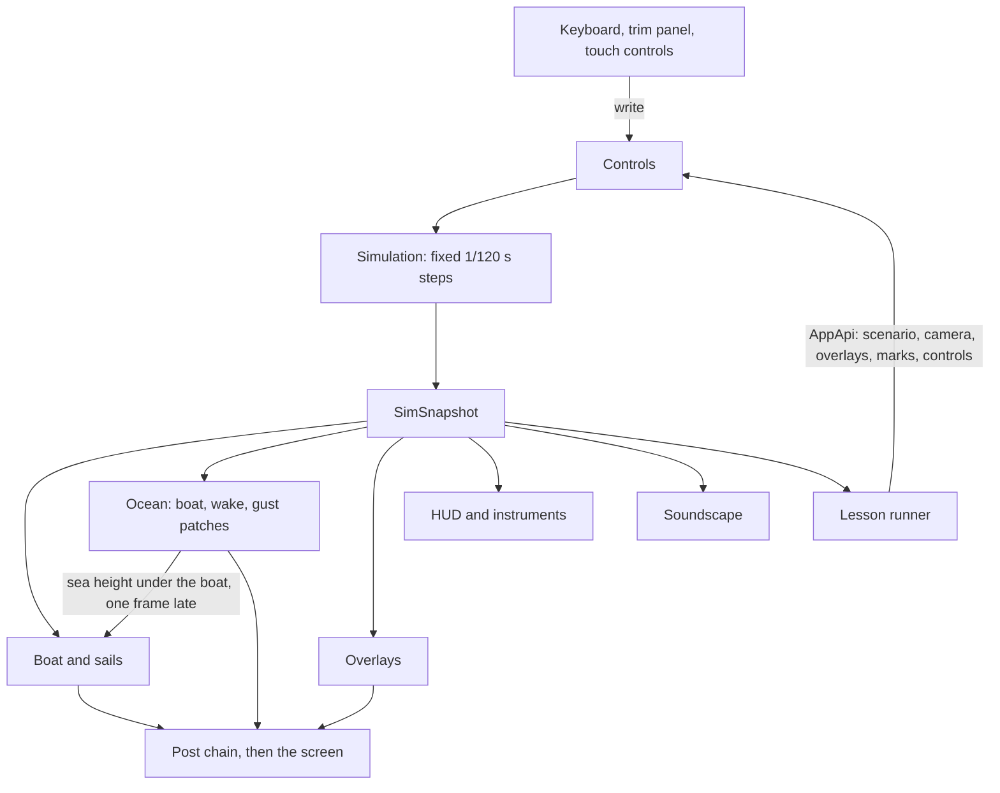

# Architecture

Sailing School is a static web app: vanilla TypeScript, [three.js](https://threejs.org/) r186 on WebGL 2, and the
pmndrs [postprocessing](https://github.com/pmndrs/postprocessing) library. Those two are the only runtime
dependencies. There is no UI framework: the interface is plain DOM, updated directly. It is built with Vite and
tested with Vitest and Playwright, with TypeScript in strict mode.

The app loads no image, model or sound files. The sea, sky, boat, sails, textures and sounds are all generated in
code at run time.

This page covers:

- [Module map](#module-map)
- [Boundaries](#boundaries)
- [What happens every frame](#what-happens-every-frame)
- [The snapshot](#the-snapshot)
- [Frames and sign conventions](#frames-and-sign-conventions)
- [Quality tiers and the governor](#quality-tiers-and-the-governor)
- [Testing strategy](#testing-strategy)
- [How the polars are generated](#how-the-polars-are-generated)

For the physics itself, see [physics.md](physics.md); for the graphics, [rendering.md](rendering.md).

## Module map

| Path | What it does | Main files |
|---|---|---|
| [`src/main.ts`](../src/main.ts) | Boots the app, or shows a message when WebGL 2 is missing or start-up fails | |
| [`src/app/`](../src/app) | The `App`: owns the renderer, the scene, the simulation and the UI, implements `AppApi`, and runs the frame loop | `App.ts`, `loop.ts` (fixed-step clock), `labPanel.ts` (Sail lab), `telltaleCam.ts` (picture-in-picture view) |
| [`src/shared/`](../src/shared) | What physics and graphics share: every boat dimension, frame conversions, vector maths, units | `boatSpec.ts`, `coords.ts`, `math.ts`, `units.ts` |
| [`src/sim/`](../src/sim) | The physics, in plain TypeScript | `simulation.ts`, `wind.ts`, `apparent.ts`, `aero.ts`, `sails/`, `hydro.ts`, `autopilot.ts`, `autocrew.ts`, `events.ts`, `vpp.ts`, `polarTable.ts`, `types.ts`, `data/polars.json` |
| [`src/flow/`](../src/flow) | A 2-D vortex-lattice solver for horizontal slices through the sails, in plain TypeScript | `vortexLattice.ts`, `grid.ts`, `slices.ts` |
| [`src/render/core/`](../src/render/core) | Renderer set-up, post-processing, quality tiers and the governor | `renderer.ts`, `post.ts`, `quality.ts`, `types.ts` |
| [`src/render/env/`](../src/render/env) | Sky, clouds, sunlight, distant land, race marks and the ocean | `sky.ts`, `volumetricClouds.ts`, `lighting.ts`, `land.ts`, `marks.ts`, `ocean/` |
| [`src/render/boat/`](../src/render/boat) | The procedural boat: hull, deck, cabin, cockpit, keel and rudder, rig, fittings, ropes and crew | `BoatModel.ts` and one file per part |
| [`src/render/sails/`](../src/render/sails) | Sailcloth, its material and textures, telltales, the windex and the burgee | `SailsView.ts`, `sailMesh.ts`, `clothMaterial.ts` |
| [`src/render/overlays/`](../src/render/overlays) | The teaching overlays | `Overlays.ts`, one file per overlay, `flowField.ts` (snapshot → flow field) |
| [`src/render/cameras/`](../src/render/cameras) | Chase, helm, top, sail and free cameras | `CameraRig.ts` |
| [`src/ui/`](../src/ui) | The HUD: top bar, trim panel, instruments and wind dial, view bar, lesson panel, polar chart, toasts, menu, help, keyboard | `Hud.ts`, `input.ts`, `trimPanel.ts` |
| [`src/lessons/`](../src/lessons) | The lesson engine, the glossary and the curriculum | `engine.ts`, `types.ts`, `glossary.ts`, `curriculum/` |
| [`src/audio/`](../src/audio) | The procedural WebAudio soundscape | `Soundscape.ts`, one file per layer, `mapping.ts` (simulation → sound parameters) |
| [`src/testing/`](../src/testing) | A helper for wall-clock budgets in tests | `perf.ts` |
| [`demos/`](../demos) | A standalone page per module, served by the dev server only | |
| [`scripts/`](../scripts) | `polars.ts` regenerates the polar table; `snap.mjs` takes headless screenshots | |
| [`e2e/`](../e2e) | Playwright smoke tests against the production build | |

## Boundaries

- **`src/sim` and `src/flow` never import three.js or touch the DOM.** They run, and are tested, in plain Node.
- **Renderers only read.** They consume the `SimSnapshot` and `boatSpec`, and never change the simulation.
- **The UI changes the boat only through `Controls`** (the values the simulation reads every step: sheets, traveler,
  tiller, autopilot mode and so on) **and the `AppApi`** (mode, camera, overlays, wind, time of day, quality, sound).
- **Lessons read snapshots and drive the app through `AppApi`**: scenario, camera, overlays, marks and controls. The
  lesson engine has no DOM; the lesson panel implements a small `LessonView` interface, and the tests use a fake one.
- **Boat dimensions live in `boatSpec.ts` only**, so the physics and the 3-D model can't disagree about the boat.

## What happens every frame

`App.frame` ([`src/app/App.ts`](../src/app/App.ts)) runs these steps in order:

1. **Input.** Held keys move the controls at fixed rates; one-shot keys fire commands (tack, gybe, hoist and so on).
2. **Physics.** The fixed-step clock ([`loop.ts`](../src/app/loop.ts)) runs as many exact 1/120 s steps as real time
   (times the time scale, 0.25× to 2×) calls for. At most 12 run in one frame; any backlog beyond that is dropped
   rather than allowed to snowball. Pause runs none. Each step of `Simulation.step` does this:
   1. advance the wind;
   2. let the crew work (auto-trim, manoeuvres);
   3. turn the helm or autopilot into a rudder angle, limited to 60°/s;
   4. move the crew;
   5. compute all the forces;
   6. integrate;
   7. detect events.
3. **Snapshot.** One `SimSnapshot` per frame. Events raised during the frame's steps are drained into it.
4. **Boat pose.** The pose is interpolated between the last two physics states, so motion is smooth at any refresh
   rate. Heave, pitch and a little roll from the drawn waves are added on top.
5. **Sails, then the boat.** The sailcloth, telltales, windex and burgee update first. Then the boom, rudder and
   tiller, jib clew, sheets, spinnaker pole and crew follow the snapshot. The order matters for the spinnaker: its
   guy and sheet are made fast to the foot corners where the cloth draws them, which glide between the snapshot's
   corners through a gybe.
6. **Environment.** The ocean gets the boat (for the wake and hull waves) and the gust patches. The sky does one unit
   of cloud work (a tile of the cloud panorama, or a strip of the environment map), meters the exposure and dims
   the sun under a cloud. The shadow frustum follows the boat, and the marks ride the water.
7. **Camera, overlays, sound, HUD.** The HUD reports how much of the window its panels cover
   (`Hud.safeArea()`, cached until the layout changes). The camera rig follows the boat and keeps her in the middle
   of what is left; the overlays keep their labels inside it and clear of the wind dial. Then the soundscape, the
   HUD and, in Sail lab, the lab panel update. The HUD refreshes its digits about 15 times a second and moves needles
   and bars every frame.
8. **Lessons.** The lesson runner checks the current task. Paused time doesn't count toward a task.
9. **Render.** The post chain draws the frame; the telltale cam, when it is on, re-renders its small view 20 times a
   second.
10. **Quality.** The governor gets the raw frame time and may change the tier.

The ocean's heights for the boat and the marks come from a small grid rendered on the GPU with the same displacement
as the visible sea, and read back asynchronously. They are therefore one frame late, but they never stall the GPU and
always match the water that is drawn.

## The snapshot

`SimSnapshot` ([`src/sim/types.ts`](../src/sim/types.ts)) is the contract between the physics and everything else:

| Field | Contents |
|---|---|
| `boat` | Position, heading, heel, yaw and roll rates, surge and sway speeds, speed, course over ground, leeway, rudder angle, VMG, crew position |
| `wind` | True wind speed, direction and angle; apparent wind speed and angle at 10 m and at deck level; the puffs (for the sea and the particles) |
| `sails.main`, `sails.jib`, `sails.spinnaker` | Whether the sail is set, its area and corners; its sections, each with position, chord, camber, draft, angle of attack, luffing, stall, Cl, Cd and dynamic pressure; its total force, centre of effort, lift, drag, drive and heeling force; its telltales. The main also has its boom angle and twist; the jib its clew angle, furl, backed and whisker states; the spinnaker its hoist, pole, curl and collapse. |
| `forces` | The aerodynamic total and its point; drive and side force; keel and rudder forces and their points; hull resistance; the heeling, righting and crew moments; the centres of gravity and buoyancy |
| `events` | The events since the previous snapshot: `crashGybe`, `inIrons`, `tackComplete`, `gybeComplete`, `spinCollapse`, `spinRefill`, `roundUp`, `luffing`, `backwinded` |
| `maneuver`, `towed` | The crew's current manoeuvre, if any, and whether the boat is being towed (Sail lab) |

## Frames and sign conventions

These conventions bind every module; most integration bugs come from breaking one of them. The conversions live in
[`src/shared/coords.ts`](../src/shared/coords.ts).

| Thing | Convention |
|---|---|
| Units | SI inside: m, s, kg, N, rad. Knots (1 kn = 0.514444 m/s) and degrees only in the UI |
| World (three.js) | Y up, north = −Z, east = +X. The simulation's 2-D world is (east, north) = (X, −Z) |
| Compass angles | 0 = north, clockwise positive. The true wind direction (TWD) is where the wind blows **from** |
| Body frame (simulation) | x forward, y to starboard, z down. The origin is on the centreline, at the waterline, at the centre of gravity's station. `boatSpec` lists heights h above the waterline, so z = −h |
| Heel φ | Positive = starboard side down |
| Yaw rate r | Positive = turning to starboard |
| Rudder angle δ | Positive = turns the boat to starboard (the tiller itself moves to port) |
| Wind angles (TWA, AWA) | In (−π, π], positive = wind from starboard (starboard tack) |
| Boom and jib clew angles | Positive = out to port |
| Leeway | Positive = sliding to starboard |
| Boat-local frame (three.js) | X = starboard, Y = up, Z = aft (the bow points to −Z). From the body frame: X = y, Y = −z, Z = −x |
| Boat root transform | Position (e, heave, −n); Euler order `'YXZ'` with y = −ψ, x = pitch (bow up positive), z = −(heel + wave roll) |

## Quality tiers and the governor

A tier sets the render resolution, ocean detail, reflections, shadows, bloom, particle counts and sail mesh density
([`src/render/core/types.ts`](../src/render/core/types.ts)):

| Tier | Pixel ratio cap × render scale | Ocean FFT, cascades | Ocean mesh | Planar reflection | Shadow map | Bloom | Particles | Sail mesh | Clouds |
|---|---|---|---|---|---|---|---|---|---|
| Ultra | 2 × 1.0 | 256², 3 | 100 % | full resolution | 4096 | on | 100 % | 100 % | volumetric, 1536² panorama |
| High | 1.5 × 1.0 | 256², 3 | 80 % | half resolution | 2048 | on | 100 % | 100 % | volumetric, 1024² |
| Medium | 1.25 × 0.85 | 128², 2 | 60 % | off | 2048 | on | 60 % | 75 % | volumetric, 768² |
| Low | 1 × 0.7 | 128², 2 | 40 % | off | 1024 | off | 35 % | 50 % | painted 2-D layer |

The pixel ratio is the device's, capped by the tier and then multiplied by the render scale. Ultra also switches the
anti-aliasing from FXAA to SMAA (see [rendering.md](rendering.md#post-processing)).

The **governor** ([`quality.ts`](../src/render/core/quality.ts)) runs while quality is set to **Auto**, the default.
It starts at High, or at Low when WebGL is drawn by a software rasteriser (hardware acceleration switched off, a
virtual machine, a CI runner; `isSoftwareRenderer` in [`renderer.ts`](../src/render/core/renderer.ts)), where the
higher tiers would take seconds per frame. It works like this:

- It judges 2-second windows by their **median** frame time, so a single hitch, such as a shader compiling, can't
  cost a tier.
- It steps down one tier when the median frame takes longer than 20 ms (under 50 fps).
- It steps up one tier after 10 seconds of frames costing less than 12 ms. Between the two it holds the tier.
- It ignores the first 3 seconds (start-up compiles) and the first second after every change.
- A tier that has to be dropped again soon after a step up isn't simply retried a moment later, so the quality
  doesn't bounce between tiers.
- A display capped at a lower frame rate (a battery saver, a 30 Hz monitor) looks like a slow GPU from the frame
  interval alone. Where the GPU's own time can be measured, a long interval with a cheap frame never costs a tier.
  Where it cannot, a step down is a trial: if up to two lower tiers don't shorten the interval, it is a cap, and the
  governor goes back to the tier it came from and holds it.
- Picking a tier in the quality menu locks it; choosing Auto again resumes adapting.

## Testing strategy

| Suite | Command | What it covers |
|---|---|---|
| Unit | `pnpm test` | Vitest in Node (`src/**/*.test.ts`): the physics, the flow solver, the lesson engine and curriculum, overlay maths, the ocean spectrum, FFT and height sampler, hull, crew and sail geometry, the fixed-step loop, the quality governor, keyboard input, the polar trail and toasts, and the audio graph against a strict fake `AudioContext` |
| Lesson playthroughs | part of `pnpm test` | Every lesson plays in the real simulation with the real crew; see below |
| Performance budgets | `pnpm test:perf` | The wall-clock budgets, exactly, one test file at a time |
| Real WebAudio | `pnpm test:audio` | The real soundscape rendered offline in headless Chromium |
| End-to-end smoke | `pnpm e2e` | The production build in a real browser |

**Lesson playthroughs** ([`src/lessons/__tests__`](../src/lessons/__tests__)) drive every lesson through the real
`LessonRunner`, backed by the real `Simulation` and crew, with no rendering. For every lesson they check that:

- setup and every step's hooks, checks and hints run without errors or engine warnings;
- a learner who does nothing never completes a task. They idle for at least 60 s, or the task's hold time plus 60 s,
  and longer for the long tasks listed in the harness;
- **Show me** then completes every task within 90 s of simulated time (the lesson 18 race gets 420 s). This proves
  that each task can be done in the actual physics;
- the same holds for a learner who skipped straight to the task with Next.

Static checks cover ids and order, text lengths, glossary references, camera, overlay and control names, and quizzes.

**Performance budgets.** Timing tests call `perfBudget()` from [`src/testing/perf.ts`](../src/testing/perf.ts).
Under `pnpm test:perf` (`PERF_STRICT=1`, one file at a time) the budgets are exact. In the everyday parallel suite they
are three times looser, so a busy machine doesn't cause false failures while a large regression still does. The
budgets:

| Budget | Where |
|---|---|
| One simulation step, worst setup (spinnaker, crew, gustiness 1): 50 µs | `src/sim/__tests__/simulation.test.ts` |
| Overlays' CPU cost per frame with flow and slice on, two physics steps included: 2.5 ms | `src/render/overlays/__tests__/overlays.test.ts` |
| One flow-slice rebuild: 1.0 ms upwind, 1.5 ms downwind with the spinnaker | `src/render/overlays/__tests__/flowField.test.ts` |

The flow solver's own tests also hold a slice solve (2 sails × 20 panels) under 1 ms and a velocity-grid fill under
5 ms.

**Real WebAudio.** `pnpm test:audio` sets `AUDIO_BROWSER_TESTS=1`. It renders the real `Soundscape` through an
`OfflineAudioContext` in headless Chromium, driven by `playwright-core`, and checks the signal:

- silence before start and when muted;
- the level rising with the apparent wind;
- flogging energy only while the sails luff;
- no clipping, and no clicks when parameters jump;
- stereo placement and event sounds;
- the cost of `update()`.

It needs Playwright's Chromium (`pnpm exec playwright install chromium`); without it, the suite is skipped with a note.

**End-to-end smoke** ([`e2e/smoke.spec.ts`](../e2e/smoke.spec.ts)) builds the site, serves it with `vite preview`
under the GitHub Pages path `/sailing-school/`, and opens it in Chromium. It checks that:

- the app boots and draws a lit, non-flat picture with no console errors;
- a lesson starts and shows its first step;
- the fallback message appears when WebGL 2 is unavailable (`?forceNoWebGL2`);
- the canvas follows the viewport when the window is resized.

Locally Chromium uses the GPU; in CI it falls back to SwiftShader, a software renderer.

**Continuous integration** ([`.github/workflows/ci.yml`](../.github/workflows/ci.yml)) runs on every push and pull
request to `main`. The `test` job type-checks, runs `pnpm test` and builds; the `browser` job installs Chromium and
runs `pnpm test:audio` and `pnpm e2e`. The Pages workflow ([`pages.yml`](../.github/workflows/pages.yml)) tests,
builds and deploys `main` to GitHub Pages.

**Visual checks** are done by eye: [`scripts/snap.mjs`](../scripts/snap.mjs) takes headless screenshots of the app or
any demo page. See [CONTRIBUTING.md](../CONTRIBUTING.md#screenshots-for-visual-changes).

## How the polars are generated

The polar table is the steady state of the same simulation the app runs, not a separate model.
[`scripts/polars.ts`](../scripts/polars.ts), run with `pnpm polars`:

1. calls `bestSpeed` from [`src/sim/vpp.ts`](../src/sim/vpp.ts) for true wind speeds of 4, 6, 8, 10, 12, 14, 16, 20
   and 25 knots and true wind angles from 30° to 180° in 5° steps. Each call sails a fresh `Simulation` with the crew
   trimming, the autopilot holding the angle and the wind steady, until the speed settles. From 80° off the wind and up
   to 20 knots, it sails both the jib and the spinnaker and keeps the faster set that holds the angle;
2. refines the best upwind and downwind VMG angles between grid angles with a parabola;
3. writes [`src/sim/data/polars.json`](../src/sim/data/polars.json), listing any point that never settled on its angle
   under `unconverged`. The current table has none.

The app reads the table for the polar chart, the target speed, the laylines and several lesson targets. A test in
[`vpp.test.ts`](../src/sim/__tests__/vpp.test.ts) re-sails four points and fails if the table is more than 3 % away
from the live physics, so the table can't drift from the model. See [physics.md](physics.md#11-polars-and-vmg) for
what the polars show.
